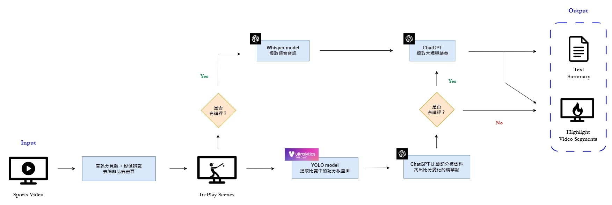

# GenAI-Star

## Overview

This project is called SSR (Smart Sports Reviewer), which is designed to generate highlights from sports videos. The project uses the YOLO algorithm for object detection and OpenAI's API for various AI-driven tasks and analyses.

## Youtube Video

<iframe width="560" height="315" src="https://www.youtube.com/embed/oKiVUgJmup8" title="YouTube video player" frameborder="0" allow="accelerometer; autoplay; clipboard-write; encrypted-media; gyroscope; picture-in-picture" allowfullscreen></iframe>

## Workflow

## Features

- **Object Detection:** Utilizes the YOLO algorithm for real-time scoreboard detection in videos.
- **AI Integration:** Incorporates OpenAI's API for various AI-driven tasks and analyses, including GPT-4o's capability for image analysis and summarizing.
- **Environment Management:** Uses dotenv for managing environment variables securely.

To see more details, please refer to each folders' README.md.
